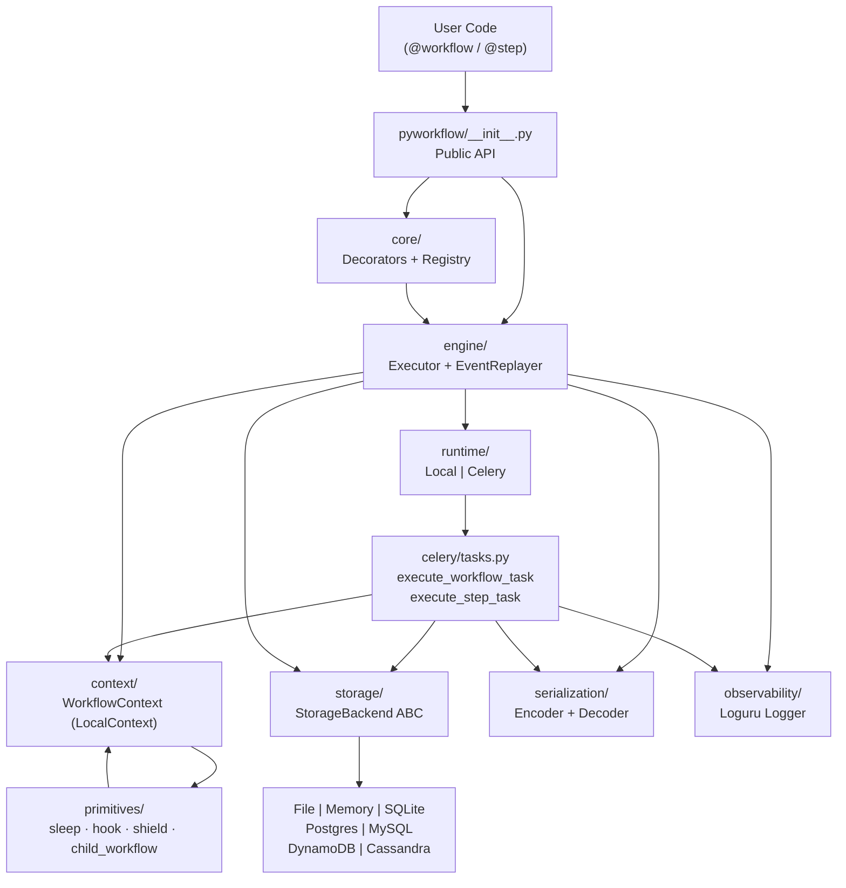

# Architecture

PyWorkflow is a Python library (v0.1.35, Python 3.11+) for building durable, event-sourced workflow orchestration with automatic retry, suspension, and fault recovery.

## Project Structure

```
pyworkflow/
├── pyworkflow/           # Main package (public API via __init__.py)
│   ├── core/             # Decorators: @workflow, @step, registry, exceptions
│   ├── engine/           # Execution, event definitions, event replay
│   ├── context/          # WorkflowContext implementations (local, mock, AWS)
│   ├── primitives/       # sleep(), hook(), shield(), start_child_workflow()
│   ├── runtime/          # Runtime adapters: local, celery
│   ├── celery/           # Celery app, task definitions, scheduler, singleton lock
│   ├── storage/          # StorageBackend ABC + 7 concrete backends
│   ├── serialization/    # JSON encoder/decoder with cloudpickle fallback
│   ├── observability/    # Loguru logging configuration
│   ├── utils/            # Duration parsing, schedule helpers
│   ├── cli/              # Click-based CLI commands
│   ├── aws/              # AWS Lambda runtime adapter
│   └── config.py         # Global configuration (pyworkflow.configure())
├── tests/
│   ├── unit/             # Isolated tests with mocked storage/Celery
│   └── integration/      # End-to-end tests with real storage backends
├── examples/             # Runnable examples (local/, celery/, aws/)
├── docs/                 # MDX documentation (Mintlify)
└── dashboard/            # Optional FastAPI + React observability UI
```

**Entry points:**
- `pyworkflow.start()` — launch a workflow execution
- `pyworkflow.resume()` — resume a suspended workflow
- `pyworkflow.cancel_workflow()` — request graceful cancellation
- `pyproject.toml` — package metadata, optional dependency groups per backend

## Architectural Pattern

PyWorkflow follows a **hexagonal (ports-and-adapters) architecture** layered over an **event-sourced execution engine**.

- The core engine (`engine/`) has zero knowledge of Celery or any storage backend. It operates through the `WorkflowContext` abstraction and `StorageBackend` interface.
- Runtime adapters (`runtime/celery.py`, `runtime/local.py`) plug in via a `Runtime` interface; the engine dispatches through whichever is configured.
- Storage backends (`storage/file.py`, `storage/postgres.py`, etc.) implement a single `StorageBackend` ABC — swapping backends requires no engine changes.
- **Event sourcing** is the persistence model: every state change appends an immutable `Event` record. On resumption, the `EventReplayer` processes events in sequence order to reconstruct in-memory state deterministically.

Key design principles:
- **Immutable event log**: State is never mutated; it is derived by replaying events.
- **Suspension-as-control-flow**: `sleep()` and `hook()` raise `SuspensionSignal` (a `BaseException`) which the executor catches and converts into a scheduled resumption.
- **Implicit context propagation**: `WorkflowContext` travels via `contextvars.ContextVar`, avoiding argument threading through the call stack.
- **Deterministic step IDs**: Step IDs are a hash of `(step_name, args, kwargs)`, making cached-result lookup idempotent across replays.

## Component Diagram



## Data Flow

### Workflow Execution (Celery + Durable)

1. **`start(workflow_func, *args)`** — `engine/executor.py` checks idempotency key, creates `WorkflowRun` record in storage, records `WORKFLOW_STARTED` event.
2. **Dispatch** — `runtime/celery.py` sends `execute_workflow_task` to the `pyworkflow.workflows` Celery queue.
3. **Workflow worker** — deserializes args, instantiates `LocalContext` (with storage), replays existing events via `EventReplayer` to restore cached step results.
4. **Step encounter** — `@step` generates a deterministic `step_id`. If `STEP_COMPLETED` event exists for this ID, the cached result is returned immediately (replay mode). Otherwise, `execute_step_task` is dispatched to the `pyworkflow.steps` queue and `SuspensionSignal` is raised.
5. **Step worker** — executes the step function, records `STEP_COMPLETED` or `STEP_FAILED`, then calls `resume(run_id)` to unblock the workflow.
6. **Workflow resumption** — replays event log, fast-forwards past completed steps, continues from the suspension point.
7. **Sleep / hook** — `sleep()` records `SLEEP_STARTED` and raises `SuspensionSignal`; the executor schedules a Celery ETA task for resumption. `hook()` records `HOOK_CREATED` and suspends; resumption is triggered when the external caller invokes `resume_hook(token, payload)`.
8. **Completion** — `WORKFLOW_COMPLETED` event recorded; `WorkflowRun.status` updated.

### Fault Recovery Flow

On task restart (worker crash), `execute_workflow_task` detects `RUNNING` or `INTERRUPTED` status, records `WORKFLOW_INTERRUPTED`, completes any pending sleeps (`SLEEP_COMPLETED`), replays the event log, and continues execution from the last checkpoint.

## External Dependencies

| Dependency | Role | Abstraction |
|---|---|---|
| Celery 5.3+ | Distributed task queues | `runtime/celery.py`, `celery/tasks.py` |
| Redis / RabbitMQ | Celery message broker | Configured via `CELERY_BROKER_URL` |
| PostgreSQL / MySQL / SQLite | Durable event storage | `StorageBackend` ABC |
| DynamoDB / Cassandra | Cloud-native event storage | `StorageBackend` ABC |
| cloudpickle 3.0+ | Serialization fallback for complex types | `serialization/encoder.py` |
| Pydantic 2.0+ | Data validation, hook payload schemas | `storage/schemas.py`, primitives |
| Loguru 0.7+ | Structured logging | `observability/logging.py` |
| AWS Lambda | Serverless runtime | `aws/` adapter, `runtime/` factory |

All external services are accessed through explicit adapter modules. The engine imports only from `StorageBackend` and `WorkflowContext` — never from concrete backends directly.

## Architecture Decision Records

### ADR-001: SuspensionSignal Inherits from BaseException

**Status**: Accepted

**Context**: Suspension must halt workflow execution unconditionally. If it extended `Exception`, a broad `except Exception` in user code could accidentally swallow it.

**Decision**: `SuspensionSignal` and `ContinueAsNewSignal` extend `BaseException`.

**Consequences**: All executor code must explicitly catch `BaseException` or `SuspensionSignal` before `Exception`.

---

### ADR-002: Deterministic Step IDs from Arguments

**Status**: Accepted

**Context**: Replay correctness requires that the same step call within a workflow always maps to the same cached result, even after a worker crash and restart.

**Decision**: Step IDs are a deterministic hash of `(step_name, serialized_args, serialized_kwargs)`. Users may override via a reserved `step_id` kwarg.

**Consequences**: Step functions must be called with the same arguments on replay to hit the cache. Non-deterministic inputs (e.g., `datetime.now()`) must be passed as workflow arguments, not generated inside the workflow function.

---

### Template for Future ADRs

```markdown
### ADR-NNN: [Title]

**Status**: Proposed | Accepted | Deprecated | Superseded by ADR-XXX

**Context**: What is the issue motivating this decision?

**Decision**: What are we doing?

**Rationale**: Why is this the best choice given the constraints?

**Consequences**: What trade-offs does this decision introduce?
```
